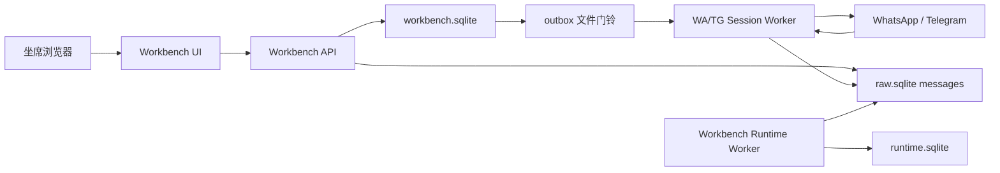

# 社媒客服工作台开发规范与边界设计

## 0. 当前定稿：工作台完全独立

日期：2026-07-07

从本次定稿开始，工作台按完整独立项目设计和实现：

- 独立登录：工作台有自己的用户身份、登录兼容层和账户设置；公网部署仍可经过 Deploy Hub / skyline-ark-sso 网关，但不沿用监控项目登录。
- 独立存储：工作台只使用自己的 `auth.sqlite`、`workbench.sqlite`、`raw.sqlite`、`runtime.sqlite`，不得读取或写入监控项目 SQLite。
- 独立权限：工作台自己的 `/admin` 管理工作台坐席、角色、入口权限、服务账号和分组范围。
- 独立前端：工作台前端不挂监控系统入口，不复用监控系统页面、路由或权限矩阵。
- 独立服务账号登录：`/service-account-login` 从工作台发起 WA/TG 登录任务，任务写入工作台 `runtime.sqlite` 和工作台 outbox，由工作台 runtime worker 执行。
- 独立 worker：工作台 runtime worker 持有工作台服务账号 session，写工作台 `raw.sqlite` / `runtime.sqlite`，不依赖监控项目 worker。

本文下方早期章节中凡是出现“读取现有 `database.sqlite`”“由现有 `social-monitor` worker 持有 session”“监控 analyzer 静默读取工作台”等描述，都只代表历史阶段方案，不再作为当前实现依据。

本文档沉淀本项目工作台的产品定位、系统边界、架构设计、UI 设计、数据流设计、数据库约束和开发落地规则。它来自前期讨论结论，用于指导后续开发，不代表现有监控系统需要立即改造。

## 1. 项目定位

工作台是一个新的日常作业系统，用于多名内部客服/业务坐席登录后查看群消息、回复客户问题、维护客户资料和记录作业动作。

它不是现有监控系统的一个智能回复页面，也不是告警、知识库、供应商画像或 AI 分析能力的入口。

核心定位：

```text
工作台 = 纯 IM 作业面
监控系统 = 旁路分析系统
WA/TG worker = 唯一渠道执行层
```

工作台负责：

- 坐席登录和权限控制
- 群列表、消息线程、回复框
- 外发消息账本
- 会话已读、客户资料、内部备注和工作台标签
- 失败重试、发送状态、操作审计

监控系统负责：

- 静默采集所有真实渠道消息
- 分析、告警、日报、知识资产、供应商画像
- 统计客服响应指标和坐席工作量
- 后台静默消费工作台产生的作业数据

渠道执行层负责：

- 持有 WhatsApp、Telegram 等工作台接入账号 session
- 接收渠道消息并写入采集库
- 从工作台外发队列取任务并发送
- 回写发送结果

## 2. 两套系统边界

| 维度 | 监控系统 | 工作台 |
| --- | --- | --- |
| 目的 | 采集、分析、告警、沉淀知识 | 日常收发消息、协作回复 |
| 用户 | 管理层、运营、分析师 | 一线客服、业务坐席 |
| 数据方向 | 采集入站、生成衍生资产 | 双向收发、记录外发和作业动作 |
| 产品心智 | 看板 | 工作面 |
| UI 内容 | 告警、画像、知识库、情报 | 群、消息、回复框、分配状态 |

工作台对监控系统的态度：

```text
工作台不消费监控系统的分析结果，也不依赖监控系统原始库。
工作台服务账号登录、原始消息、权限和作业数据都由工作台自己保存。
```

允许工作台读取：

- 自己的原始消息表 `raw.sqlite.messages`
- 自己的作业库 `workbench.sqlite`
- 自己的登录库 `auth.sqlite`
- 自己的运行态库 `runtime.sqlite`

禁止工作台读取或调用：

- 告警记录
- 问题生命周期
- 供应商画像
- 可靠性快照
- 知识资产
- QA 知识库
- 设备知识库
- 内容模板库
- AI 摘要
- AI 建议回复
- `lib/ai-client.js`

## 3. 项目目录建议

工作台应作为独立项目放在当前目录：

```text
/Users/a2026/Desktop/工作台/
├── AGENTS.md
├── DEVELOPMENT_GUIDE.md
├── frontend/
├── server/
├── db/
├── scripts/
├── docs/
└── tests/
```

推荐关系：

```text
workbench
- 新客服工作台项目
- 承载工作台 UI、API、登录、作业库、运行态库、权限和 runtime worker

social-monitor
- 另一个独立项目
- 不承载工作台登录、权限、服务账号登录、前端或 SQLite
```

工作台必须通过自己的 `/service-account-login` 入口发起 WA/TG 服务账号登录，session 由工作台 runtime worker 持有。

## 4. 总体架构



核心原则：

```text
DB = 账本
文件 = 门铃
定时扫描 = 保险
```

也就是说：

- `workbench.sqlite` 是工作台作业事实源。
- `outbox/*.json` 只用于唤醒 worker，不作为事实源。
- worker 必须定时扫描数据库兜底，避免文件事件丢失导致漏发。
- WA/TG session process 是唯一真实发送者。

## 5. UI 设计

工作台 UI 使用三列 IM 结构：会话列表、消息线程、客户资料栏。第三列只展示当前 `platform + service account + group_id` 的工作台客户资料，不展示监控分析。

```text
┌────────────────────────────────────────────────────────────┐
│ 工作台   [WA][TG] [未读][全部] [客户类型] 搜索…             │
├──────────────┬───────────────────────────┬─────────────────┤
│ 会话列表      │ 消息线程和回复框           │ 客户资料         │
│ 群A  未读3   │ 入站/外发、引用、附件       │ 名称、类型、状态 │
│ nanya_wa 2m  │ 发送状态与失败重试         │ 标签、账号状态   │
│ 群B  未读1   │                           │ 备注、操作动态   │
└──────────────┴───────────────────────────┴─────────────────┘
```

顶部区域：

- 工作台标题
- 平台多选：WA、TG
- 范围过滤：未读、全部
- 客户类型过滤：按服务账号分组的单选项
- 渠道原生标签/分组过滤：WA 标签、TG 文件夹
- 搜索框

左侧群列表：

- 平台标识
- 群名
- 渠道原生标签或文件夹，例如“售后”“代理”“重点客户”
- 最近消息预览
- 最近消息时间
- 未读徽标
- 排序只按最近消息时间，不按告警、分数或 AI 判断

中间消息线程：

- 入站气泡
- 外发气泡
- 引用回复灰色缩略
- 图片缩略
- 文件卡片
- 分页加载历史
- 顶部操作保留：标记已读、打开原生群

底部回复框：

- 多行文本
- 附件按钮
- 发送按钮
- 显示当前发送身份，例如“以 nanya_wa 身份发送”
- Enter 发送，Shift+Enter 换行

明确不做：

- 最近告警侧栏
- 供应商画像评分
- 知识资产快查
- AI 建议回复
- AI 群摘要
- 按告警等级排序
- 知识库引用按钮
- 模板下拉

## 6. 数据库设计

推荐新增独立作业库：

```text
workbench.sqlite
```

不要长期把工作台账本放进 `analytics.sqlite`，因为 `analytics.sqlite` 应该继续表示分析输出库。监控分析器未来可以只读 `workbench.sqlite`，把响应指标、坐席画像、漏接告警等结果写入 `analytics.sqlite`。

### 6.1 database.sqlite

现有采集库，由监控系统 worker 写入。

工作台只读：

- `messages`

工作台不得修改：

- `database.sqlite`
- `messages` 表结构
- 原始采集消息

第一版不要为了关联外发消息去给 `messages` 表加字段。可通过 `remote_msg_id` 和 `messages.message_id` 做逻辑关联。

### 6.2 analytics.sqlite

现有分析库。

工作台不得读取：

- 告警
- 画像
- 知识资产
- AI 分析结果
- 日报
- 供应商可靠性结果

监控分析器后续可以读取 `workbench.sqlite`，把分析结果写入 `analytics.sqlite`。

### 6.3 workbench.sqlite

工作台自己的作业库。

建议核心表：

```text
operators
- id
- username
- display_name
- role
- status
- created_at
- updated_at

outbound_messages
- id
- client_msg_id
- platform
- account
- group_id
- chat_id
- text
- quote_msg_id
- attachment_json
- status
- remote_msg_id
- created_by
- retry_of
- retry_count
- error_code
- error_message
- created_at
- updated_at
- sending_started_at
- sent_at
- delivered_at

group_assignments
- id
- platform
- account
- group_id
- assigned_to
- assigned_by
- status
- assigned_at
- released_at
- updated_at

conversation_reads
- id
- operator_id
- platform
- account
- group_id
- last_read_message_id
- last_read_at
- updated_at

agent_actions
- id
- operator_id
- action_type
- platform
- account
- group_id
- target_id
- payload_json
- created_at

send_circuit_breaker
- id
- platform
- account
- status
- reason
- failure_count
- cooldown_until
- last_failure_at
- created_at
- updated_at

channel_labels
- id
- platform
- account
- native_label_id
- name
- color
- kind
- raw_json
- synced_at
- created_at
- updated_at

conversation_label_map
- id
- platform
- account
- group_id
- native_label_id
- synced_at
- created_at
- updated_at
```

`outbound_messages.client_msg_id` 必须支持幂等：

```text
UNIQUE(created_by, client_msg_id)
```

用于处理：

- 用户重复点击发送
- 浏览器重试
- 网络超时后重新提交
- 前端刷新后恢复状态

### 6.4 渠道原生标签与分组

工作台允许识别和展示 WA/TG 账号中已经存在的原生标签或分组，但它们属于渠道元数据，不属于监控分析标签。

平台能力边界：

```text
WhatsApp:
- 可通过 whatsapp-web.js 读取账号标签、聊天标签和标签下聊天。
- 标签是账号级的，同一个群在不同 WA 账号下可能标签不同。

Telegram 用户号:
- 可通过 MTProto / GramJS 读取 Dialog Folders，也就是 Telegram App 中的聊天文件夹。
- Telegram API 内部称为 dialog filters。

Telegram Bot:
- 不能读取用户账号里的 Telegram 文件夹。
```

推荐表：

```text
channel_labels
- 保存账号维度的原生标签/文件夹
- platform + account + native_label_id 应唯一
- kind 可取 label / folder
- raw_json 保留渠道原始结构，便于后续兼容

conversation_label_map
- 保存群/会话与原生标签/文件夹的映射
- 主键或唯一约束必须包含 platform + account + group_id + native_label_id
```

同步原则：

- 标签/分组由对应 worker 同步到 `workbench.sqlite`。
- 工作台 UI 只读同步结果，用于筛选、展示和默认分组。
- 工作台第一版不修改 WA 原生标签，也不修改 TG 文件夹。
- 标签/分组不得与监控系统告警等级、供应商评分、知识资产标签混用。
- TG 文件夹可能包含规则型条件，例如所有群、排除已读、排除静音；同步时应物化为当前可见群映射，并保留 `raw_json`。

## 7. 外发状态机

推荐状态：

```text
pending    排队中
sending    发送中
sent       本地发送成功
delivered  对端已收或渠道回执已确认
failed     本次发送失败，可重试
dead       多次失败或风控后放弃
paused     账号处于熔断/暂停中
canceled   坐席取消，尚未发送
```

基础流转：

```text
pending -> sending -> sent -> delivered
                  \-> failed -> pending/sending
                  \-> dead
pending -> canceled
pending/sending -> paused
```

要求：

- `pending` 可以取消。
- `sending` 必须有 `sending_started_at`。
- worker 启动时要扫描超时 `sending`，例如超过 60 秒未完成则重置或标失败。
- `failed` 的重试建议新建一条 `outbound_messages`，通过 `retry_of` 指向旧行，保留完整审计。
- `dead` 不直接改回发送，编辑重发时新建外发记录。
- `paused` 表示账号熔断，UI 提示等待恢复或管理员处理。

## 8. 数据流设计

### 8.1 入站消息流

```text
WA/TG 收到消息
-> 工作台 runtime worker on(message/message_create)
-> 写入 raw.sqlite.messages
-> 工作台读取自己的 messages 展示
```

工作台看到的是原始消息，不是分析后的消息。

### 8.2 外发消息流

```text
坐席点击发送
-> POST /api/workbench/reply
-> Workbench API 鉴权
-> 校验平台、账号、群权限、client_msg_id
-> 写 workbench.sqlite.outbound_messages(status=pending)
-> 写 outbox/worker-{platform}-{account}/{outbound_id}.json 作为门铃
-> worker 被唤醒
-> WA worker 从 workbench.sqlite 按账号 FIFO 查询 pending
-> TG worker 优先 claim 门铃指定 outbound_id，随后再兜底扫描 pending
-> 对应账号 runtime 串行 sendMessage
-> 回写 sent/failed/paused/dead
-> 渠道 message_create 事件把真实外发消息写入 raw.sqlite.messages
-> 通过 remote_msg_id 与 outbound_messages 关联
```

顺序要求：

```text
必须先写数据库，再写文件门铃。
```

文件门铃丢失不影响一致性，因为 worker 有定时扫描。

平台差异：

- WhatsApp 外发采用账本化串行队列，按 `platform + account + created_at/id` 保守 FIFO 消费，避免同账号并发和高频风控。
- Telegram 外发采用账本化即时派发。API 仍必须先写 `outbound_messages`，但 TG worker 收到门铃后可以优先 claim 门铃里的 `outbound_id`，不被同账号更早的普通 pending 长时间阻塞。
- TG 即时派发不得绕过账号发送开关、坐席权限、`send_circuit_breaker`、`next_attempt_at`、发送 lease、失败重试和审计。
- API 进程不得直接持有 WA/TG client；真实发送者仍然只能是对应账号 runtime worker。

### 8.3 文件门铃

示例目录：

```text
outbox/
├── worker-wa-nanya_wa/
│   └── 10001.json
└── worker-tg-user-main/
    └── 10002.json
```

文件内容只需要最小信息：

```json
{
  "outbound_id": 10001,
  "platform": "wa",
  "account": "nanya_wa",
  "created_at": "2026-07-02T00:00:00.000Z"
}
```

处理规则：

- 文件只唤醒 worker。
- worker 必须回数据库查真实任务。
- 文件重复不影响发送，因为数据库状态会去重。
- worker 处理完成后可删除文件。
- 删除失败也不影响最终一致性。
- TG worker 可以读取门铃里的 `outbound_id` 作为即时派发目标；读取失败时必须降级为普通 DB 扫描。

### 8.4 worker 消费策略

worker 启动：

```text
1. 扫描本账号 pending 任务
2. 扫描本账号超时 sending 任务
3. 监听 outbox 对应目录
4. 每 30 秒定时扫描 DB 兜底
5. 同一账号 concurrency = 1 串行发送
```

TG worker 收到门铃时，优先处理门铃指定的 `outbound_id`；WA worker 收到门铃时只把门铃视为唤醒信号，继续按 FIFO 消费。

查询边界：

```text
WHERE platform = ? AND account = ? AND status IN ('pending')
ORDER BY created_at ASC
LIMIT ?
```

同一个账号只能由对应 worker 发送，不得跨账号抢任务。

WA 的 `client.sendMessage` 不应并发调用。同账号发送必须串行，以减少 session 异常、乱序、掉线和风控风险。

### 8.5 渠道标签/分组同步流

渠道原生标签/分组同步由 worker 执行，不由工作台 API 或前端直接读取 WA/TG session。

```text
worker-wa-{account}
-> client.getLabels() / getChatLabels(chatId)
-> 写 workbench.sqlite.channel_labels
-> 写 workbench.sqlite.conversation_label_map
-> Workbench UI 用于群列表筛选和展示

worker-tg-user-{account}
-> Api.messages.GetDialogFilters
-> 解析文件夹 include/exclude 规则
-> 物化当前可见群映射
-> 写 workbench.sqlite.channel_labels
-> 写 workbench.sqlite.conversation_label_map
-> Workbench UI 用于群列表筛选和展示
```

建议同步时机：

- worker ready 后同步一次。
- 每 10-30 分钟低频同步一次。
- 发生渠道侧标签/文件夹更新事件时可触发增量同步。
- 手动刷新只允许触发 worker 同步请求，不允许工作台直接登录渠道。

第一版同步范围：

- 只读标签和分组。
- 只展示和筛选。
- 不在工作台内新增、编辑、删除 WA 标签。
- 不在工作台内新增、编辑、删除 TG 文件夹。

## 9. WA/TG session 边界

严禁工作台自己创建或登录同一个 WA/TG session。

错误模式：

```text
工作台 API 创建 WA client
坐席浏览器创建 WA client
监控 worker 也持有 WA session
```

正确模式：

```text
工作台只写 outbound_messages
worker-wa-{account} 是唯一发送者
worker-tg-user-{account} 是唯一发送者
worker-tg-bot 是唯一 Bot 发送者
```

这样可以降低：

- session 冲突
- Chrome 多进程争抢
- 重复发送
- 顺序错乱
- 账号掉线
- 平台风控

## 10. 风险控制

WhatsApp 账号风险高于 Telegram，尤其当前模式基于 WhatsApp Web 自动化而非官方 Business API。

WA 外发第一版必须保守：

- 只做人工回复
- 不做自动群发
- 不做营销触达
- 不做批量私聊
- 不做高频自动回复
- 单账号限速
- 单账号串行
- 失败熔断
- 保留审计
- 优先使用低风险测试账号灰度

熔断建议：

```text
单账号 5 分钟内 failed >= 3
-> 写 send_circuit_breaker(status='cooldown')
-> 新任务标 paused 或保持 pending 但不发送
-> UI 提示账号暂停
-> 可通知管理员
```

Telegram 用户号必须遵守：

- FloodWait 等待时间
- PeerFlood 立即停止或隔离
- 不并发执行多个高风险任务

## 11. API 设计

建议统一前缀：

```text
/api/workbench/*
```

核心接口：

```text
GET  /api/workbench/accounts
GET  /api/workbench/channel-labels
GET  /api/workbench/groups
GET  /api/workbench/groups/:groupId/messages
POST /api/workbench/reply
POST /api/workbench/messages/read
POST /api/workbench/groups/:groupId/assign
POST /api/workbench/groups/:groupId/release
POST /api/workbench/outbound/:id/cancel
POST /api/workbench/outbound/:id/retry
GET  /api/workbench/outbound/:id
```

`POST /api/workbench/reply` 请求体建议：

```json
{
  "client_msg_id": "uuid-from-frontend",
  "platform": "wa",
  "account": "nanya_wa",
  "group_id": "120363...",
  "text": "预计明天中午到达",
  "quote_msg_id": "optional-message-id"
}
```

返回：

```json
{
  "ok": true,
  "outbound_id": 10001,
  "status": "pending"
}
```

幂等规则：

- 如果同一 `created_by + client_msg_id` 已存在，直接返回已有 `outbound_id`。
- 不重复创建外发任务。

## 12. 生产影响与部署边界

本地开发工作台不会影响当前生产监控系统，除非执行以下操作：

- 推送并部署到生产服务
- 修改 `ecosystem.cloud.config.js`
- 修改 `docker-entrypoint.sh`
- 在生产 worker 上开启工作台外发开关
- 对生产 WA/TG 账号启用发送

第一版开发建议：

```text
阶段 1：工作台 UI + API + 独立 SQLite，不启用发送
阶段 2：工作台服务账号登录入口和本地单个测试账号 outbound 消费
阶段 3：生产单账号灰度，限速、熔断、审计全部打开
```

生产相关默认要求：

- 不修改生产 PM2 配置。
- 不开启生产外发。
- 不读取或修改监控项目采集库。
- 不改监控项目分析器主链路。
- 不将 session、token、SQLite 数据文件提交到版本库。

## 13. 与监控系统彻底分离

工作台代码应在 `workbench/` 内实现。默认不得修改或依赖现有 `social-monitor`。

当前定稿：

```text
工作台服务账号登录：
- 由 /service-account-login 发起。
- 登录任务写入 runtime.sqlite。
- 账号档案写入 raw.sqlite。
- outbox/login-worker-* 唤醒工作台 runtime worker。

工作台完整群列表、WA 原生标签、TG 用户号文件夹：
- 由工作台 runtime worker 同步。
- 同步结果写入 workbench.sqlite / raw.sqlite。
- 不依赖 social-monitor worker。
```

工作台 runtime worker 使用自己的环境变量，例如：

```text
WORKBENCH_RUNTIME_WORKER=1
WORKBENCH_SEND_ENABLED=0
WORKBENCH_LABEL_SYNC_ENABLED=1
WORKBENCH_CHAT_SYNC_ENABLED=1
WORKBENCH_DB_PATH=/path/to/workbench.sqlite
WORKBENCH_RAW_DB_PATH=/path/to/raw.sqlite
WORKBENCH_RUNTIME_DB_PATH=/path/to/runtime.sqlite
WORKBENCH_OUTBOX_DIR=/path/to/outbox
```

禁止把工作台能力做成监控主链路的一部分。

## 14. 开发顺序

推荐 MVP 顺序：

1. 建立 `workbench.sqlite` schema 和初始化脚本。
2. 建立 Workbench API，先只读 `messages` 聚合已采集群和消息，不修改原监控 worker。
3. 建立 `channel_labels` 与 `conversation_label_map`，先支持手工/模拟数据展示。
4. 建立三列 Workbench UI，支持平台、未读、客户类型、渠道标签/分组筛选。
5. 增加 `outbound_messages` 写入和文件门铃。
6. 本地 worker 接入 outbound 消费器，先支持一个测试账号。
7. 本地 worker 接入完整群列表同步，补齐没有近期消息的群。
8. 本地 worker 接入 WA 标签同步和 TG 用户号文件夹同步，只读展示。
9. 增加已读、客户资料、内部备注、操作日志。
10. 增加失败重试、熔断、状态可视化。
11. 后续再让监控 analyzer 静默读取 `workbench.sqlite` 生成指标。

暂缓功能：

- AI 回复建议
- 知识库引用
- 告警联动
- 供应商画像展示
- 在工作台内编辑 WA 标签或 TG 文件夹
- 复杂工单流
- 本地 HTTP/IPC 直连 worker
- 多级审批

## 15. 一句话定稿

```text
工作台是一个只有收、发、分派、已读四件事的极简 IM；
监控系统是从工作台和渠道消息中静默吸取数据、生产洞察的后台；
两者通过原始消息和工作台作业账本自然汇合，但 UI、权限、数据库和业务逻辑必须分开。
```
