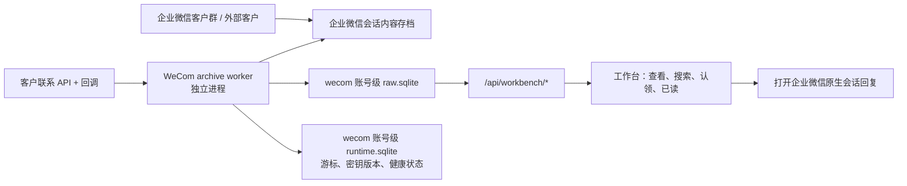

# 企业微信接入前调研

日期：2026-07-22
范围：独立社媒客服工作台接入企业微信（WeCom）；本文件是调研结论，不启用真实企业、真实会话内容或真实外发。

已确认的产品目标：通过工作台完成企业微信企业接入，获取授权范围内的群聊列表及开启会话内容存档后的消息，并由坐席在工作台会话窗口发起群内回复。这里的“全部”受企业微信存档开启范围、外部联系人同意状态、应用可见范围及接口保留能力约束，不表示能读取启用存档之前或未授权范围内的历史消息。

## 结论

企业微信可以接入本工作台，但应先明确业务目标：

1. **客户群/员工与客户的完整会话可读**：可行，建议以企业微信的**会话内容存档**作为唯一正式消息源。
2. **工作台中以员工身份直接回复企业微信客户群**：当前不应承诺。会话内容存档是获取和解密会话记录的能力，不是代员工发消息的能力；常规客户联系 API 可以同步客户、客户群及变更事件，也不是一个任意群内回复 API。
3. **建设新的微信客户统一客服入口**：可行，优先评估**微信客服 API**。它支持管理客服账号、分配会话、接收和发送客服消息，但这是新的客服通道，不会接管已有员工客户群。
4. **企业内部机器人对话**：2026 年新增的企业微信**智能机器人 WebSocket 长连接**可官方双向收发、流式回复，Node.js 有官方 SDK；当前适用机器人私聊和企业内部群，不能据此推断支持外部客户群。
5. **向内部企业微信群发送通知**：可用群机器人 Webhook，但它是单向推送，不能作为完整客服收发渠道。
6. **企业内部员工通知**：可由自建应用的应用消息能力实现；它面向应用可见范围的内部成员，不等于客户群客服能力。

因此必须先按对象分流：若目标是**已有员工客户群**，一期采用“会话内容存档只读接入 + 打开原生会话回复”；若目标是**新建统一客服入口并在本工作台完整收发**，一期应改为微信客服 API。智能机器人只用于企业内部机器人会话，不能替代前两者。

### 已确认目标的可实现范围

| 目标群类型 | 群列表与存档消息 | 工作台直接回复 | 回复身份 |
| --- | --- | --- | --- |
| 已有外部客户群（群内含微信客户） | 可在授权、存档和客户同意范围内接入；只能取得开启存档后可归档的消息 | 官方能力不能支持任意坐席代指定员工在既有客户群即时回复 | 需回到原生企业微信，由员工本人回复 |
| 已有普通企业内部群 | 存档范围内可读取 | 自建应用不能直接接管任意已有内部群；可评估把智能机器人加入目标群 | 机器人身份，不是员工身份 |
| 自建应用创建的应用群聊 | 可由应用维护群及消息业务数据 | 可通过 `appchat/send` 向该应用创建的群发送 | 应用身份；不是已有普通群或客户群 |
| 新建微信客服会话 | 可通过微信客服接口完整接入会话 | 可以 | 微信客服账号；是一对一客服入口，不是客户群 |

因此，若验收标准同时要求“已有外部客户群 + 所有可存档消息 + 不跳出工作台即时回复”，当前官方接口无法完整满足。可交付的两种产品选择是：

1. **保留既有客户群**：工作台负责群列表、存档消息、搜索、认领、已读和审计；回复按钮打开企业微信原生会话。
2. **接受新的发送身份/会话形态**：内部群使用智能机器人身份，外部客户咨询改为微信客服，从而在工作台完成官方双向收发。

## 2026-07-22 文档复核与结论更新

本次复核了《企业微信API对接CRM系统_技术方案与落地指南》（V1.0，2026-01-22）。它对“会话内容存档需由 SDK 增量拉取、解密、幂等入库和媒体分片下载”的工程思路有参考价值；但其目标是通用 CRM，且包含若干不应直接作为本工作台实施前提的说法。本调研的主结论不变，并新增以下约束：

| 文档说法 | 复核结论 | 工作台处理 |
| --- | --- | --- |
| `POST /cgi-bin/appchat/send` 可“通过应用往外部群推消息” | 不成立为“以员工身份向已有外部客户群任意回复”的依据。应用群聊与客户群是不同对象。 | 不将它接入 `wecom` 客户群外发；保留“原生企业微信回复”的一期边界。 |
| CRM 可“查看和参与”既有外部客户群 | “查看”可由会话内容存档实现；“参与/回复”不能由存档能力推导出来。 | 客户群 connector 只读，不生成无法发送的 `outbound_messages`。 |
| JS-SDK 创建外部群、`check_single_agree`、同意默认规则和 `sys_approval_change` 可按文中方式使用 | 这些能力、适用对象、回调事件和同意状态语义需要在目标企业管理员后台与接入当天的官方接口文档逐项验证，不能以方案文档中的名称或默认行为建模。 | PoC 中以真实测试租户的接口回包和合规确认定义“部分未存档”状态；不假设能拿到逐客户同意状态或补齐缺失消息。 |
| 400/900/1800 元/人/年、最低起购数、试用期、固定限流阈值 | 价格、试用、开通范围与限流属于易变商业/平台配置，不能作为预算或容量承诺。 | 仅记录为待向企业微信/服务商取得书面报价及配额的验证项。worker 实施限速、退避和积压监控，不硬编码文中的数字。 |
| 员工企微多端登录限制、设备白名单是存档 worker 的稳定性前提 | 不适用于本架构：存档 worker 使用企业管理员配置的 SDK 凭据与私钥，不登录或托管员工企微客户端。 | 不引入员工 session、设备管理或“仅手机登录”作为 connector 设计；若 CRM 另做企业微信 SSO，再单独评估登录策略。 |
| 用 CRM 库保存完整解密 JSON、再用于画像/敏感词风控 | 与工作台“独立、纯 IM、无 AI/监控分析”的边界不符，且会扩大敏感数据面。 | 原文仅写入工作台自己的 `raw.sqlite`，最小字段投影到 `workbench.sqlite`；不接入画像、敏感词分析或监控项目库。 |

**新增验收门槛**：在实现任何企业微信客户群外发前，必须以目标企业的官方文档、管理员授权配置和低风险测试会话，证明“目标对象 + 发送身份 + API + 回复窗口/限制”同时成立。没有该证据，即以原生客户端回复作为产品验收标准；不得用应用群聊、Webhook、RPA、hook 或共享员工 session 替代。

## 官方能力与适配度

| 能力 | 可获得的数据/动作 | 是否满足工作台客户群收发 | 结论 |
| --- | --- | --- | --- |
| 会话内容存档 | 已授权范围内的内部、外部联系人、客户群会话内容；通过 SDK 拉取、解密并下载媒体 | 仅收取，不能代员工发送 | 客户群入站和历史的首选 |
| 客户联系 API | 外部联系人、客户群列表与详情、成员与标签；客户关系/客户群变更回调 | 不能提供完整消息流，也不提供任意客户群回复 | 用于元数据补全和增量发现 |
| 自建应用/应用消息 | 向应用可见范围内的企业成员发应用消息；接收应用回调 | 不面向外部客户群 | 仅用于内部运营通知 |
| 群机器人 Webhook | 向配置该机器人的内部群推送文本、图片、文件等 | 只发不收，且不是员工身份 | 仅用于运行告警或上线通知 |
| 智能机器人 WebSocket | 机器人私聊、企业内部群中的消息收发、流式回复、媒体与事件 | 双向，但对象是机器人会话，不是已有员工客户群 | 可做内部机器人 connector，不用于客户群客服 |
| 微信客服 | 官方客服账号与微信客户的会话；可通过 API 管理账号、分配会话、收发消息 | 支持完整客服坐席链路，但与客户群、员工个人聊天不是同一对象 | 最适合“工作台统一收发”的新客服入口 |

参考：企业微信会话内容存档的[使用前帮助](https://developer.work.weixin.qq.com/document/path/91361)、[微信客服概述](https://developer.work.weixin.qq.com/document/path/94638)、[智能机器人长连接](https://developer.work.weixin.qq.com/document/path/101463)、[客户群列表接口](https://qyapi.weixin.qq.com/cgi-bin/externalcontact/groupchat/list)、[群机器人发送接口](https://qyapi.weixin.qq.com/cgi-bin/webhook/send)。接口开通范围、频率、消息类型与 SDK 版本须以接入当天企业微信管理后台和官方文档为准。

## 市场与 GitHub 实现方式（2026-07-21 检索）

市场与开源项目没有一个“万能企业微信 connector”，而是按官方能力拆成五种实现：

| 实现模式 | 市场/开源常见做法 | 能解决什么 | 对本工作台的判断 |
| --- | --- | --- | --- |
| SCRM / 第三方应用 | 企业安装第三方应用，服务商保存 `suite_ticket`、永久授权码并换取企业 token；再调用客户联系 API。会话正文另购/开通会话存档 | 多企业授权、客户/群/标签、侧边栏、SOP、会话质检 | 本项目是单一独立工作台，PoC 先用企业自建应用；除非未来做 SaaS，不必先实现服务商套件授权体系 |
| 会话存档 sidecar | Linux 进程加载企业微信 C SDK，按 `seq` 拉取密文、RSA 解密、分片下载媒体，再通过本地 HTTP/队列/数据库交给业务系统 | 已有员工与客户、客户群的完整合规存档 | 与当前客户群只读需求最匹配；应做独立 worker/sidecar，不能把私钥暴露给 API 服务 |
| 微信客服 connector | 公网加密回调接收入站；按游标同步消息；通过客服 API 分配会话、在回复窗口内发送；维护客服账号、客户与会话状态 | 新的微信一对一客服入口、统一坐席收发 | 与现有工作台形态最匹配，建议作为可双向 PoC 首选 |
| 智能机器人长连接 | 用 `BotID + Secret` 主动连接 `wss://openws.work.weixin.qq.com`，收到机器人私聊/内部群消息后流式被动回复；主动发送常结合应用消息或 Webhook | 内部问答、员工助手、内部群机器人 | Node.js 技术适配最好，但不是客户群通道；且本工作台禁止 AI，不直接引入 OpenClaw/AstrBot |
| Webhook / 应用消息 | 群 Webhook 只推送；自建应用用 `access_token` 向可见内部成员发送并接收应用回调 | 告警、审批、内部通知 | 不能包装成客服账号，避免误用 |

### 有参考价值的 GitHub 项目

| 项目 | 观察到的实现 | 成熟度信号 | 采用建议 |
| --- | --- | --- | --- |
| [binarywang/WxJava](https://github.com/binarywang/WxJava) | Java 企业微信 CP SDK，覆盖服务端 API | Apache-2.0，约 33k stars，持续发布；生态成熟 | 作为 API 行为和异常处理参考；不为本 Node.js 项目引入 Java runtime |
| [NICEXAI/WeWorkFinanceSDK](https://github.com/NICEXAI/WeWorkFinanceSDK) | Go 封装官方会话存档 C SDK，包含消息解密与媒体分片下载 | Apache-2.0，约 318 stars；Linux only | 适合作为 archive sidecar PoC 参考，需自行补游标持久化、密钥管理、指标与恢复 |
| [Hanson/WeworkMsg](https://github.com/Hanson/WeworkMsg) | 把 C SDK 封成 Linux HTTP 服务，提供 `/get_chat_data`、`/get_media_data` 和 CLI | MIT，约 28 stars，2026 年有 release；仓库规模较小 | 可快速验证 C SDK 运行环境；生产不可原样暴露 HTTP，私钥和接口都要收紧 |
| [wenerme/go-wecom](https://github.com/wenerme/go-wecom) | Go SDK，覆盖客户联系、微信客服、第三方应用、智能机器人 WS 和会话存档 | Apache-2.0，约 99 stars；覆盖面广，但 GitHub release 较旧 | 适合核对请求模型和做 Go sidecar 选型，需按当前官方文档逐接口验收 |
| [sunnoy/openclaw-plugin-wecom](https://github.com/sunnoy/openclaw-plugin-wecom) | 基于官方 `@wecom/aibot-node-sdk` 的 WebSocket 长连接，多机器人、去重、断线和补发模式 | 2026 年活跃、126 commits；OpenClaw 专用 | 借鉴 WS 生命周期、去重和重连；不要把 AI/Agent 依赖带入工作台 |
| [pawastation/wechat-kf](https://github.com/pawastation/wechat-kf) | TypeScript 微信客服回调与收发，展示 CorpID、Secret、Token、EncodingAESKey 和回复窗口处理 | MIT，约 22 stars、116 commits、2026 releases；社区仍小 | 最贴近工作台双向客服 PoC，可读实现与测试，但应重新实现业务边界，不直接内嵌插件 |
| [openscrm/api-server](https://github.com/openscrm/api-server) | Go + React 的开源 SCRM，拆分会话存档、侧边栏、客户和群管理 | Apache-2.0；功能完整但技术栈重、项目维护节奏需复核 | 只借鉴领域模型与授权流程，不建议移植其 MySQL/Redis 全栈 |

检索中也存在企业微信 PC hook、Xposed、RPA、个人号托管等项目。这类方案能够“看起来接管任何会话”，但依赖客户端版本、规避官方接口并持有员工会话，存在封禁、泄密、审计失真和升级即失效风险，不进入本工作台候选方案。

### 市场产品的共同架构

主流 SCRM 产品通常不是在网页里直接控制企业微信客户端，而是组合以下层次：

```text
企业/服务商授权
  -> 客户联系 API 同步客户、客户群、标签和变更事件
  -> 会话内容存档 SDK 拉取并解密聊天记录（通常是付费/授权能力）
  -> 企业微信侧边栏/H5 给员工提供客户画像、SOP、表单等辅助页面
  -> 群发、欢迎语、联系我等使用明确开放的运营接口
  -> 真实员工客户群回复仍发生在企业微信客户端
```

若产品主打“统一网页坐席直接收发”，市场上更常见的底层通道其实是**微信客服**，而不是把员工客户群变成可远程控制的聊天账号。微信客服官方文档明确允许经授权的第三方应用管理指定客服账号、分配会话和收发消息；同一客服账号同一时间只能授权一方开发者管理，授权给第三方后原生接待规则可能暂停，因此必须做接管/退出和故障降级设计。

## 推荐的技术路线

### 路线 A：已有员工客户群——存档只读接入



- 新增平台标识 `wecom`，账户应代表 `corp_id + archive_scope`（而非某位员工的个人登录 session）。
- 新 worker 只使用企业微信的 `corp_id`、会话存档 `secret` 和加密私钥；不模拟客户端、不抓取员工 session，也不触碰 WA/TG worker。
- 采用**按存档序号持续拉取**：游标只在消息已解密、入库且附件任务已持久化后提交；重启从最后安全游标恢复。接口并非普通 webhook 消息流，故轮询间隔、空结果退避、限速和积压告警应由 worker 管理。
- 原始密文、解密后的结构化字段、媒体下载状态和不可解析记录要可审计。`message_id` 应由存档消息序号/原生 ID 派生，保证重复拉取不会重复展示。
- 客户联系 API 的群列表、群详情与变更回调用于群名、成员和群生命周期补全；不能代替存档消息。
- UI 将“发送”替换为“在企业微信中回复”或明确禁用；不向 `outbound_messages` 写一条永远无法被官方渠道发送的 `pending` 任务。

### 路线 B：新统一客服入口——微信客服双向接入

- 创建测试微信客服账号，通过官方加密回调和消息同步接口接收入站，映射为 `platform=wecom-kf` 的独立会话。
- 以客服账号为渠道账户，保存客户、会话接待状态、最后入站时间、回复额度/窗口和游标；不要与企业微信成员或客户群 ID 混用。
- 工作台回复仍走 `outbound_messages` 账本、文件门铃和独立 worker；worker 调微信客服发送接口并回写状态。
- 对接管、转人工、结束会话、重复回调、顺序错乱、超出回复窗口、附件上传与第三方授权撤销做状态机测试。
- 该路线能提供真正的网页坐席收发，但客户必须从微信客服链接、二维码、小程序、公众号等入口发起咨询，不能迁移已有客户群上下文。

### 路线 C：仅在官方能力验证后决定客户群外发

外发必须先完成一个真实但低风险的沙箱验证，验证对象、身份和限制应逐项记录。若官方仍不能支持目标“客户群中以指定员工身份回复”，保留原生客户端回复，不使用 RPA、hook、逆向协议、个人号托管或共享员工 session 规避限制。

若另行接入“微信客服”，应作为 `wecom-kf` 独立 connector：独立账户模型、收发窗口、客服账号、授权和测试矩阵，不能假定它能覆盖客户群。

## 对当前工作台的影响

现有实现把平台限制在 `wa`、`tg`，且每个账号 runtime worker 长期持有渠道 session。企业微信存档的运行模型不同，不能简单复制：

| 现有位置 | 当前假设 | WeCom 需要的调整 |
| --- | --- | --- |
| `db/account-db.js`、`db/raw-db.js`、`server/routes/workbench.js` | 平台只能是 `wa` 或 `tg` | 扩展为 `wecom`，同时审查所有白名单、UI 文案、测试夹具 |
| `workers/service-login-worker.js` | 服务账号通过二维码、Bot token 或用户 session 接入 | 新增企业管理员配置/校验流；不接管员工个人 session |
| `workers/account-runtime-worker.js` | 持有 WA/TG client 并可消费外发账本 | 单独 `wecom-archive-worker`；职责为拉取、解密、入库、媒体下载和元数据同步 |
| `raw.sqlite.messages` | 适合消息正文与媒体基本字段 | 可复用核心字段，但建议增加 provider 序号、密钥版本、解密状态、消息类型、撤回/编辑状态与保留策略；敏感原文不写入宽泛日志 |
| `outbound_messages` 与回复框 | 所有平台都允许 worker 串行发送 | `wecom` 客户群一期不创建外发任务；界面展示能力限制 |
| 账号隔离目录 | `accounts/{wa|tg}/{account}` | 使用 `accounts/wecom/{corp_scope}/`，仍分别保存 `raw.sqlite`、`runtime.sqlite`、`workbench.sqlite`、附件与 outbox；不得与监控项目或 WA/TG 账号共用数据库/运行态 |

## 安全、合规与运维准入

会话内容包含客户与员工的个人信息，可能还包含敏感信息。以下项目是上线前的阻塞条件，而非可选优化：

1. **企业微信侧授权**：管理员开通会话内容存档，配置存档员工范围、调用 IP 与消息加密公钥；确认外部联系人同意与企业内部告知流程已完成。
2. **数据处理依据与告知**：法务/隐私负责人明确处理目的、字段、保存期限、访问对象和个人权利响应流程。个人信息保护法要求在有特定目的、充分必要并采取严格保护措施的前提下处理敏感个人信息；涉及跨境存储或处理时，须另行评估并满足相应告知/同意要求。[个人信息保护法（网信办）](https://www.cac.gov.cn/2021-08/20/c_1631050028355286.htm)
3. **密钥管理**：会话存档 RSA 私钥、`secret` 与 `corp_id` 使用部署密钥管理，不写入 `.env`、SQLite、outbox、日志、测试 fixture 或 git。支持密钥轮换和历史密钥版本解密。
4. **访问控制**：沿用工作台独立操作员、账号范围和审计表；增加“查看会话正文/下载附件”的细粒度权限。默认最小范围，客服不能下载不属于自己范围的附件。
5. **保留与删除**：建立消息、附件、失败密文和备份的保留期；支持按企业、群、联系人和账号范围执行合法删除/冻结请求，并覆盖 SQLite、媒体文件、索引和备份。
6. **安全运行**：工作台 API 不持有会话存档 SDK 实例；独立 worker 处理拉取和解密。对每次拉取记录游标、条数、失败码、延迟与积压；正文和 token 严禁写日志。
7. **变更与灰度**：先接入一个低风险测试企业/最小存档范围，仅验证读取与恢复。未完成上列核验前，不启用真实数据持久化。

本节为工程风险清单，不构成法律意见；正式上线前应由企业法务、隐私与安全负责人完成书面确认。

## 建议验证清单（PoC 前）

- [ ] 确认目标优先级：客户群只读、原生回复跳转，还是另行建设微信客服一对一。
- [ ] 企业管理员确认可开通会话内容存档，并提供测试企业、测试员工范围、测试客户/客户群和公网出口 IP。
- [ ] 获得不含生产密钥的 SDK/平台兼容性验证条件；确认 Node.js 侧绑定方案或独立受控 sidecar 的运维方式。
- [ ] 对文本、图片、文件、语音/视频、引用、撤回、群系统消息、成员变更和重复拉取建立样本矩阵。
- [ ] 验证断网、worker 重启、游标重复、私钥轮换、附件下载失败和 API 限流下的恢复行为。
- [ ] 验证坐席范围隔离、审计、保留期、删除请求与日志脱敏。
- [ ] 以测试数据确认官方是否存在满足目标身份与客户群的发送 API；没有则将“原生客户端回复”写入一期验收标准。

## 预计实施拆分（待 PoC 结论后）

1. 平台抽象与 `wecom` 账号级数据库路径、权限和 UI 标签。
2. 企业微信管理员接入配置、凭据安全存储和健康检查。
3. `wecom-archive-worker`：SDK 适配、游标、解密、幂等入库、媒体任务与指标。
4. 客户联系元数据同步与群变更回调。
5. 工作台只读会话展示、原生回复入口和“能力受限”状态。
6. 安全与恢复测试、最小范围灰度、上线评审。

在完成第 0 项（业务目标及管理员/合规准入）前，不建议开始改动现有 WA/TG 登录或外发逻辑。
