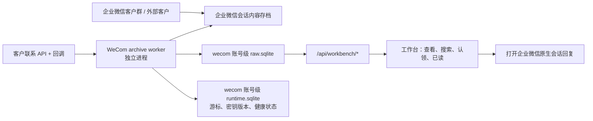

# 企业微信接入前调研

日期：2026-07-21  
范围：独立社媒客服工作台接入企业微信（WeCom）；本文件是调研结论，不启用真实企业、真实会话内容或真实外发。

## 结论

企业微信可以接入本工作台，但应先明确业务目标：

1. **客户群/员工与客户的完整会话可读**：可行，建议以企业微信的**会话内容存档**作为唯一正式消息源。
2. **工作台中以员工身份直接回复企业微信客户群**：当前不应承诺。会话内容存档是获取和解密会话记录的能力，不是代员工发消息的能力；常规客户联系 API 可以同步客户、客户群及变更事件，也不是一个任意群内回复 API。
3. **向内部企业微信群发送通知**：可行，但只能用群机器人 Webhook，且它是单向推送，不能作为客服收发渠道。
4. **企业内部员工通知**：可由自建应用的应用消息能力实现；它面向应用可见范围的内部成员，不等于客户群客服能力。

因此，建议将一期定义为 **“企业微信会话存档只读接入 + 打开原生会话回复”**。工作台可统一展示、搜索、认领、已读、审计和提醒；坐席点击“在企业微信中回复”后，仍在受企业微信客户端控制的原生会话中发送。只有在业务场景改为“微信客服”的官方客服账号（通常为一对一）且官方能力经实测满足时，才另行评估服务器外发。

## 官方能力与适配度

| 能力 | 可获得的数据/动作 | 是否满足工作台客户群收发 | 结论 |
| --- | --- | --- | --- |
| 会话内容存档 | 已授权范围内的内部、外部联系人、客户群会话内容；通过 SDK 拉取、解密并下载媒体 | 仅收取，不能代员工发送 | 客户群入站和历史的首选 |
| 客户联系 API | 外部联系人、客户群列表与详情、成员与标签；客户关系/客户群变更回调 | 不能提供完整消息流，也不提供任意客户群回复 | 用于元数据补全和增量发现 |
| 自建应用/应用消息 | 向应用可见范围内的企业成员发应用消息；接收应用回调 | 不面向外部客户群 | 仅用于内部运营通知 |
| 群机器人 Webhook | 向配置该机器人的内部群推送文本、图片、文件等 | 只发不收，且不是员工身份 | 仅用于运行告警或上线通知 |
| 微信客服 | 官方客服账号与客户的客服消息通道 | 与客户群、员工个人聊天不是同一对象 | 若目标是统一在线客服，应单独立项验证 |

参考：企业微信会话内容存档的[使用前帮助](https://developer.work.weixin.qq.com/document/path/91361)、[客户群列表接口](https://qyapi.weixin.qq.com/cgi-bin/externalcontact/groupchat/list)、[群机器人发送接口](https://qyapi.weixin.qq.com/cgi-bin/webhook/send)。接口开通范围、频率、消息类型与 SDK 版本须以接入当天企业微信管理后台和官方文档为准。

## 推荐的技术路线

### 一期：存档只读接入（推荐）

- 新增平台标识 `wecom`，账户应代表 `corp_id + archive_scope`（而非某位员工的个人登录 session）。
- 新 worker 只使用企业微信的 `corp_id`、会话存档 `secret` 和加密私钥；不模拟客户端、不抓取员工 session，也不触碰 WA/TG worker。
- 采用**按存档序号持续拉取**：游标只在消息已解密、入库且附件任务已持久化后提交；重启从最后安全游标恢复。接口并非普通 webhook 消息流，故轮询间隔、空结果退避、限速和积压告警应由 worker 管理。
- 原始密文、解密后的结构化字段、媒体下载状态和不可解析记录要可审计。`message_id` 应由存档消息序号/原生 ID 派生，保证重复拉取不会重复展示。
- 客户联系 API 的群列表、群详情与变更回调用于群名、成员和群生命周期补全；不能代替存档消息。
- UI 将“发送”替换为“在企业微信中回复”或明确禁用；不向 `outbound_messages` 写一条永远无法被官方渠道发送的 `pending` 任务。

### 二期：仅在官方能力验证后决定外发

外发必须先完成一个真实但低风险的沙箱验证，验证对象、身份和限制应逐项记录。若官方仍不能支持目标“客户群中以指定员工身份回复”，保留原生客户端回复，不使用 RPA、hook、逆向协议、个人号托管或共享员工 session 规避限制。

若另行接入“微信客服”，应作为 `wecom-kf` 独立 connector：独立账户模型、收发窗口、客服账号、授权和测试矩阵，不能假定它能覆盖客户群。

## 对当前工作台的影响

现有实现把平台限制在 `wa`、`tg`，且每个账号 runtime worker 长期持有渠道 session。企业微信存档的运行模型不同，不能简单复制：

| 现有位置 | 当前假设 | WeCom 需要的调整 |
| --- | --- | --- |
| `db/account-db.js`、`db/raw-db.js`、`server/routes/workbench.js` | 平台只能是 `wa` 或 `tg` | 扩展为 `wecom`，同时审查所有白名单、UI 文案、测试夹具 |
| `workers/service-login-worker.js` | 服务账号通过二维码、Bot token 或用户 session 接入 | 新增企业管理员配置/校验流；不接管员工个人 session |
| `workers/account-runtime-worker.js` | 持有 WA/TG client 并可消费外发账本 | 单独 `wecom-archive-worker`；职责为拉取、解密、入库、媒体下载和元数据同步 |
| `raw.sqlite.messages` | 适合消息正文与媒体基本字段 | 可复用核心字段，但建议增加 provider 序号、密钥版本、解密状态、消息类型、撤回/编辑状态与保留策略；敏感原文不写入宽泛日志 |
| `outbound_messages` 与回复框 | 所有平台都允许 worker 串行发送 | `wecom` 客户群一期不创建外发任务；界面展示能力限制 |
| 账号隔离目录 | `accounts/{wa|tg}/{account}` | 使用 `accounts/wecom/{corp_scope}/`，仍分别保存 `raw.sqlite`、`runtime.sqlite`、`workbench.sqlite`、附件与 outbox；不得与监控项目或 WA/TG 账号共用数据库/运行态 |

## 安全、合规与运维准入

会话内容包含客户与员工的个人信息，可能还包含敏感信息。以下项目是上线前的阻塞条件，而非可选优化：

1. **企业微信侧授权**：管理员开通会话内容存档，配置存档员工范围、调用 IP 与消息加密公钥；确认外部联系人同意与企业内部告知流程已完成。
2. **数据处理依据与告知**：法务/隐私负责人明确处理目的、字段、保存期限、访问对象和个人权利响应流程。个人信息保护法要求在有特定目的、充分必要并采取严格保护措施的前提下处理敏感个人信息；涉及跨境存储或处理时，须另行评估并满足相应告知/同意要求。[个人信息保护法（网信办）](https://www.cac.gov.cn/2021-08/20/c_1631050028355286.htm)
3. **密钥管理**：会话存档 RSA 私钥、`secret` 与 `corp_id` 使用部署密钥管理，不写入 `.env`、SQLite、outbox、日志、测试 fixture 或 git。支持密钥轮换和历史密钥版本解密。
4. **访问控制**：沿用工作台独立操作员、账号范围和审计表；增加“查看会话正文/下载附件”的细粒度权限。默认最小范围，客服不能下载不属于自己范围的附件。
5. **保留与删除**：建立消息、附件、失败密文和备份的保留期；支持按企业、群、联系人和账号范围执行合法删除/冻结请求，并覆盖 SQLite、媒体文件、索引和备份。
6. **安全运行**：工作台 API 不持有会话存档 SDK 实例；独立 worker 处理拉取和解密。对每次拉取记录游标、条数、失败码、延迟与积压；正文和 token 严禁写日志。
7. **变更与灰度**：先接入一个低风险测试企业/最小存档范围，仅验证读取与恢复。未完成上列核验前，不启用真实数据持久化。

本节为工程风险清单，不构成法律意见；正式上线前应由企业法务、隐私与安全负责人完成书面确认。

## 建议验证清单（PoC 前）

- [ ] 确认目标优先级：客户群只读、原生回复跳转，还是另行建设微信客服一对一。
- [ ] 企业管理员确认可开通会话内容存档，并提供测试企业、测试员工范围、测试客户/客户群和公网出口 IP。
- [ ] 获得不含生产密钥的 SDK/平台兼容性验证条件；确认 Node.js 侧绑定方案或独立受控 sidecar 的运维方式。
- [ ] 对文本、图片、文件、语音/视频、引用、撤回、群系统消息、成员变更和重复拉取建立样本矩阵。
- [ ] 验证断网、worker 重启、游标重复、私钥轮换、附件下载失败和 API 限流下的恢复行为。
- [ ] 验证坐席范围隔离、审计、保留期、删除请求与日志脱敏。
- [ ] 以测试数据确认官方是否存在满足目标身份与客户群的发送 API；没有则将“原生客户端回复”写入一期验收标准。

## 预计实施拆分（待 PoC 结论后）

1. 平台抽象与 `wecom` 账号级数据库路径、权限和 UI 标签。
2. 企业微信管理员接入配置、凭据安全存储和健康检查。
3. `wecom-archive-worker`：SDK 适配、游标、解密、幂等入库、媒体任务与指标。
4. 客户联系元数据同步与群变更回调。
5. 工作台只读会话展示、原生回复入口和“能力受限”状态。
6. 安全与恢复测试、最小范围灰度、上线评审。

在完成第 0 项（业务目标及管理员/合规准入）前，不建议开始改动现有 WA/TG 登录或外发逻辑。
