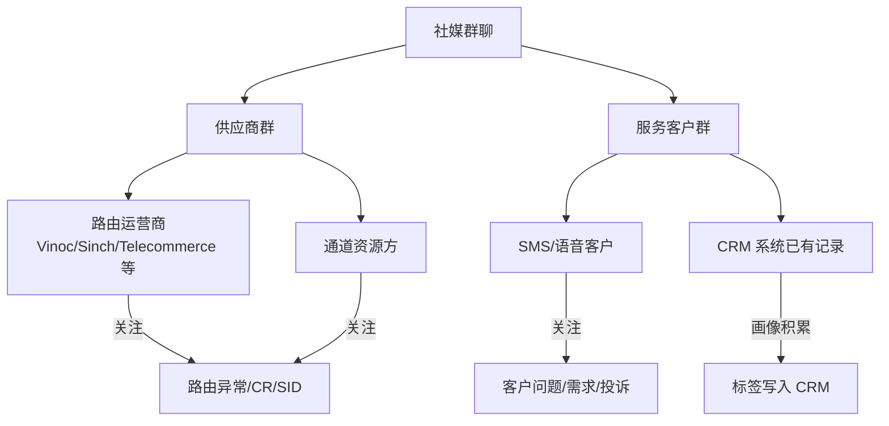
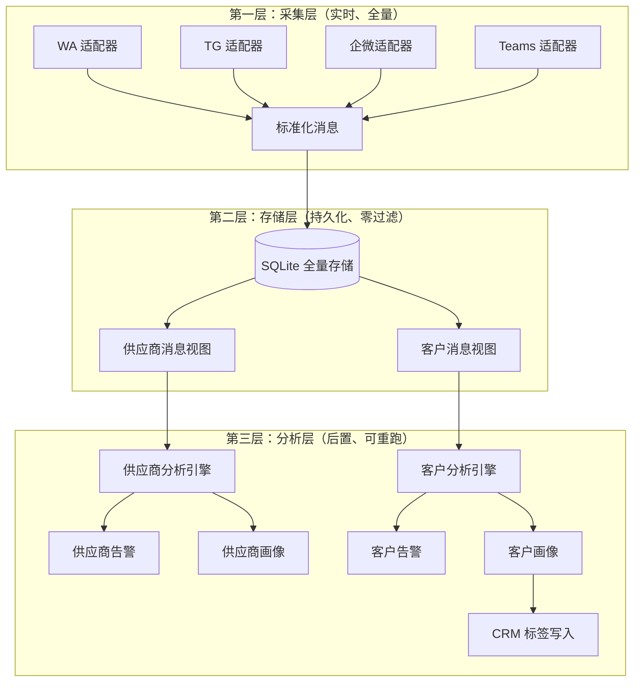
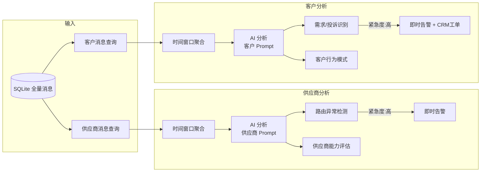
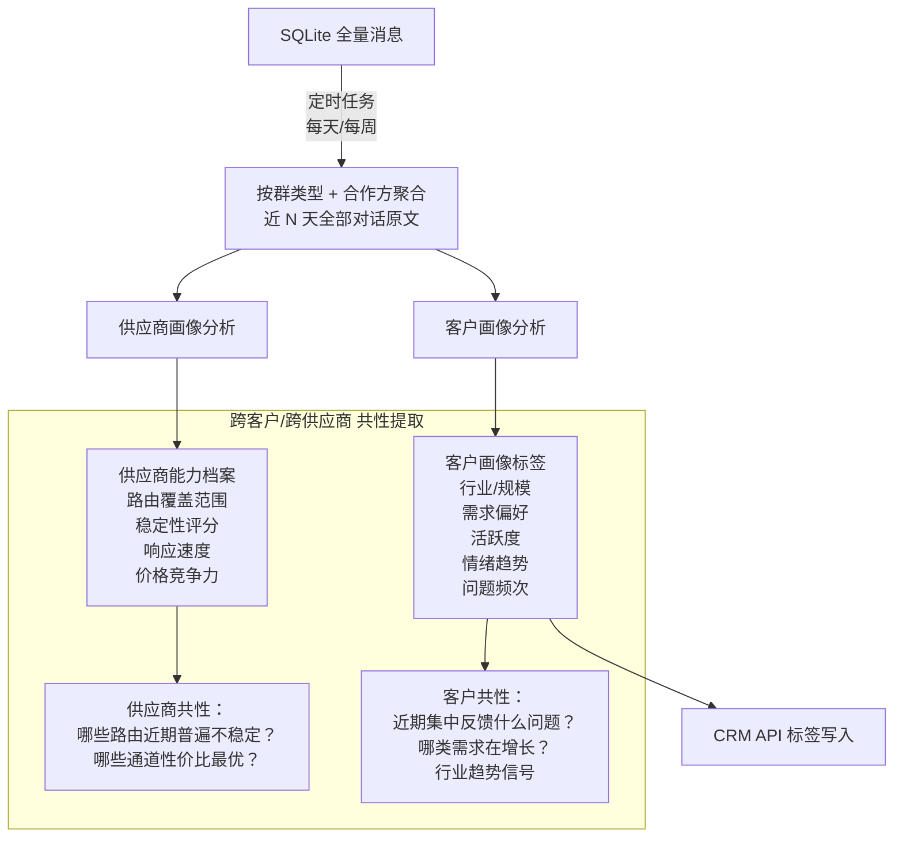
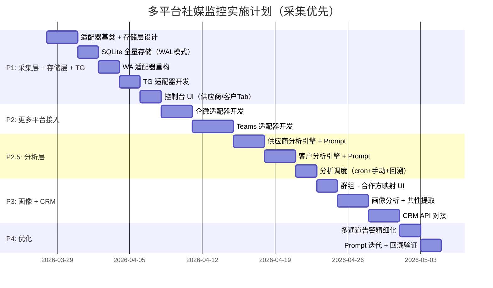

# 多平台社媒监控系统 — 可行性分析（v2）

> 基于 WhatsApp Monitor v2.3.1 扩展为 WA + TG + 企微 + Teams 统一监控平台
> 部署环境：云服务器（需公网 IP）

---

## 一、业务场景定义

### 两类客户群体



| 维度 | 供应商群 | 服务客户群 |
|------|---------|-----------|
| 平台分布 | WA（主）、TG、Teams | WA、TG、企微、Teams |
| 监控重点 | 路由异常、CR 告警、SID 管理 | 客户问题、需求记录、满意度 |
| 告警目标 | 内部钉钉/企微即时告警 | 内部告警 + CRM 工单 |
| 画像需求 | 供应商能力档案（路由覆盖、稳定性） | 客户需求偏好、问题历史、活跃度 |

### 核心监控原则
- **重群聊、轻个人**：所有平台均以群聊消息监控为主
- **群聊 = 客户/供应商的天然单位**：一个群通常对应一个合作方
- **数据积累优先**：先完整记录，再通过 AI 逐步构建画像

---

## 二、各平台群聊监控能力验证

### 对比矩阵

| 能力 | WhatsApp | Telegram | 企微 | Teams |
|------|----------|----------|------|-------|
| **接入方式** | whatsapp-web.js（逆向） | Bot API（官方） | 自建应用回调（官方） | Bot Framework + Graph API（官方） |
| **群消息获取** | ✅ `message_create` 事件 | ✅ `bot.on('message')`  关闭隐私模式后可收全部消息 | ✅ 配置回调 URL 后，企微主动 POST 加密消息到服务器 | ✅ RSC 权限 `ChannelMessage.Read.Group`，Bot 加入 Team 后接收全部消息 |
| **群列表获取** | ✅ `client.getChats()` | ✅ Bot 被加入的群自动可见 | ✅ 群列表 API | ✅ Graph API `teams` |
| **群成员列表** | ✅ `chat.participants` | ✅ `getChatMember` | ✅ 群成员 API | ✅ Graph API `team/members` |
| **需公网 IP** | ❌ 主动轮询 | ❌ Long Polling 模式不需要 / Webhook 需要 | ✅ **必须** | ✅ Bot Service endpoint **必须** |
| **管理员权限** | 不需要 | 不需要 | ✅ 企微管理后台 | ✅ Azure AD + M365 管理员 |
| **是否官方 API** | ❌ 逆向 | ✅ 官方 | ✅ 官方 | ✅ 官方 |
| **部署复杂度** | 中（Puppeteer） | 🟢 低 | 🟡 中（AES 加解密） | 🔴 高（Azure 全家桶） |
| **Node.js SDK** | `whatsapp-web.js` | `telegraf` / `grammy` | `@wecom/crypto` + axios | `botbuilder` + `@microsoft/microsoft-graph-client` |

### 各平台关键结论

**Telegram** — ✅ 最容易接入
- 通过 @BotFather 创建 Bot → 关闭隐私模式 → 把 Bot 加入群聊 → 即可接收所有消息
- 支持 Long Polling（不需要公网 IP）和 Webhook 两种模式
- 无需任何管理员审批

**企微** — ✅ 可行，需管理员配合
- 后台创建自建应用 → 配置回调 URL（公网）→ 消息 AES 加解密 → 被动接收群消息
- 应用被加入群聊后即可接收该群所有消息
- 需要：企微管理员权限 + 公网 URL + Token/EncodingAESKey

**Teams** — ✅ 可行，门槛最高但方案明确
- 通过 RSC（Resource-Specific Consent）权限模型，Bot 安装到 Team 后无需 `@mention` 即可接收全部频道消息
- 需配置 `ChannelMessage.Read.Group` 权限到 App Manifest
- 需要：Azure AD 应用注册 + M365 订阅 + Team Owner 安装授权
- 好消息：不需要 tenant-wide admin consent（RSC 是 team owner 级别授权）

---

## 三、核心设计理念

> [!IMPORTANT]
> **全量采集 → 持久存储 → 后置分析**
>
> 聊天记录的完整保存是一切后续分析的基础。采集层只负责「忠实记录」，不做任何过滤或判断。
> 分析是下游消费者，可以随时调整策略、重新跑批，而数据一旦漏采就无法挽回。

### 三层解耦架构



### 供应商 vs 客户：分开监控

| 维度 | 供应商监控 | 客户监控 |
|------|-----------|----------|
| 数据来源 | `group_type = 'supplier'` 的群 | `group_type = 'client'` 的群 |
| 分析侧重 | 路由异常、CR 告警、SID/通道变更、价格波动 | 客户需求、投诉反馈、合作意向、技术问题 |
| 分析频率 | 可实时（窗口模式） | 可批量（每日/每周汇总） |
| 告警通道 | 钉钉/企微即时推送 | 钉钉 + CRM 工单 |
| 画像输出 | 供应商能力档案（路由覆盖、稳定性评分） | 客户偏好标签（写入 CRM） |
| AI Prompt | 供应商专用判断树（关注技术指标） | 客户专用判断树（关注业务需求） |

> 两类群共享同一套采集和存储基础设施，仅在分析层通过 `group_type` 字段分流到不同的分析引擎和 Prompt 模板。

---

## 四、三大业务能力技术方案

### 能力 1：全量数据采集 + 持久化存储

**核心原则**：采集层不做任何业务判断，只负责原样记录每一条群聊消息。

**标准化消息结构**：
```javascript
{
  messageId:  '平台原始消息 ID',   // 用于去重
  platform:   'whatsapp' | 'telegram' | 'wecom' | 'teams',
  groupId:    '原始群组 ID',
  groupName:  '群组名称',
  groupType:  'supplier' | 'client' | 'unknown',  // 群分类
  senderName: '发言人名称',
  senderId:   '平台原始 ID',
  content:    '消息文本内容（原文）',
  time:       '2026-03-25T14:30:00+08:00',   // ISO 8601
  messageType:'text' | 'image' | 'file' | 'audio' | 'system',
  attachments: [],          // 附件元信息（路径/URL）
  rawPayload: {},           // 平台原始数据（可选，用于溯源）
  clientId:   'CRM 客户 ID' // 来自 group_client_map 映射
}
```

**采集层职责边界**：
```
✅ 做：连接平台 → 监听消息 → 标准化格式 → 写入 SQLite
❌ 不做：AI 分析 / 紧急度判定 / 告警推送 / 过滤
```

**消息去重**：基于 `platform + messageId` 唯一键，防止网络重连导致的重复消息。

### 能力 2：分类分析 + 共性提取 + 告警

分析层独立于采集层运行，消费 SQLite 中的全量数据。



**分析模式**：

| 模式 | 触发方式 | 适用场景 | 说明 |
|------|---------|---------|------|
| **实时窗口** | 每 N 条消息 / 每 M 分钟 | 供应商路由异常检测 | 近实时，延迟 1-5 分钟 |
| **定时批量** | cron 定时任务（每天/每周） | 客户需求汇总、共性提取 | 批量处理，成本低 |
| **手动触发** | Web 控制台按钮 | 特定群/时间段的深度分析 | 按需使用 |
| **回溯分析** | 调整 Prompt 后重新跑批 | AI 分析策略迭代优化 | 全量数据的核心价值 |

> [!TIP]
> 「先存后分析」的最大优势：当你发现 AI Prompt 需要调整时，可以**对历史数据重新跑分析**，而不需要重新采集。数据永远在那里。

**告警规则**：

| 群类型 | 场景 | 触发条件 | 推送通道 |
|--------|------|---------|----------|
| 供应商 | 路由异常 | AI 判定为「高」（CR=0%/路由不可用） | 钉钉 + 企微机器人 |
| 供应商 | 日常沟通 | AI 判定为「低」 | 仅存储分析结果，不推送 |
| 客户 | 投诉/紧急需求 | AI 判定为「高」或含投诉关键词 | 钉钉 + CRM 工单 |
| 客户 | 一般需求 | AI 判定为「中」 | 钉钉 + CRM 记录 |
| 客户 | 日常沟通 | AI 判定为「低」 | 仅存储，纳入画像分析 |

### 能力 3：画像积累 + 共性提取 + CRM 标签

画像分析是「分类分析」的高阶应用，基于积累的全量数据进行周期性深度分析。



**共性提取 Prompt 示例**（跨客户汇总分析）：
```
以下是本周所有客户群的 AI 分析摘要汇总（共 {N} 个客户群）。
请提取跨客户的共性模式：

【各客户摘要】
{all_client_summaries}

输出 JSON：
{
  "common_issues": ["多个客户反馈印度路由CR下降", "价格咨询频次增加"],
  "demand_trends": ["OTP 短信需求增长", "语音通道询价增多"],
  "risk_signals":  ["3个客户提及竞品报价"],
  "opportunities": ["墨西哥市场需求集中爆发"]
}
```

**前置条件**：
1. **全量消息持久化** — SQLite 完整存储所有群聊消息原文
2. **群组→合作方映射表** — 每个群关联一个供应商 ID 或 CRM 客户 ID
3. **足够的数据积累** — 画像分析建议至少积累 1-2 周数据后启动
4. **CRM API 对接** — 需确认 CRM 系统的标签/字段写入接口

---

## 五、架构设计

### 核心稳定性设计：多进程隔离 (Process Isolation)

> [!WARNING]
> 各平台官方 API 稳定性极高（Telegram/企微/Teams），但 **WhatsApp 依赖逆向 Chromium，极度消耗资源且易崩溃 (如 OOM, Session失效)**。

如果在同一个 Node.js 进程中运行这 4 个适配器，一旦 WhatsApp 崩溃，将导致整个 Node 进程退出，直接造成其他三大官方渠道采集被迫中断（**火烧连营**）。

因此，我们必须在架构上采用 **进程级隔离**：
1. **PM2 统一调度编排**：主 Web 服务和各个渠道的采集器各自作为独立的 Node.js 进程运行。
2. **故障隔离**：WhatsApp 崩了只会重启自己的进程，永远不影响核心系统的分析任务和其他渠道。
3. **防内存泄漏**：在 PM2 配置中利用 `max_memory_restart: '1G'` 动态重启 WhatsApp 进程，完美防御隐式浏览器引擎引起的内存泄漏。

### 项目结构（三层分离 + 多进程部署）

```
social-monitor/
├── ecosystem.config.js              ← 【核心】PM2 多进程编排配置文件（守护独立进程）
├── server.js                        ← 主进程：服务 Web 控制台 + 分析调度
│
├── adapters/                        ← 【采集层】平台适配器（各自作为独立入口运行）
│   ├── base.js                      ← 适配器基类（连接管理、重连、心跳）
│   ├── wa-worker.js                 ← WA 独立进程入口（whatsapp-web.js）
│   ├── tg-worker.js                 ← TG 独立进程入口（telegraf/grammy）
│   ├── wecom-worker.js              ← 企微独立进程入口（回调+加解密）
│   └── teams-worker.js              ← Teams 独立进程入口
│
├── store/                           ← 【存储层】数据持久化（支持并发写入）
│   ├── db.js                        ← SQLite 连接 + WAL 模式初始化（防止并发死锁）
│   ├── message-writer.js            ← 消息写入（去重 + 批量写入）
│   └── migrations/                  ← 数据库迁移脚本
│
├── analysis/                        ← 【分析层】独立于采集运行
│   ├── scheduler.js                 ← 分析任务调度（cron + 手动触发）
│   ├── supplier-analyzer.js         ← 供应商群分析引擎 + Prompt
│   ├── client-analyzer.js           ← 客户群分析引擎 + Prompt
│   ├── profiler.js                  ← 画像分析（供应商档案/客户画像）
│   ├── pattern-extractor.js         ← 跨群共性提取
│   └── prompts/                     ← AI Prompt 模板（可独立迭代）
│       ├── supplier-realtime.md
│       ├── client-daily.md
│       ├── supplier-profile.md
│       ├── client-profile.md
│       └── cross-pattern.md
│
├── alert/                           ← 告警推送
│   ├── alerter.js                   ← 统一告警分发
│   ├── dingtalk.js                  ← 钉钉 Webhook
│   ├── wecom-bot.js                 ← 企微机器人 Webhook
│   └── crm.js                       ← CRM 工单 API
│
├── monitor/                         ← 【健康监控】系统自检与告警
│   ├── health-check.js              ← 定时巡检各渠道连通性及 API 额度
│   ├── heartbeat.js                 ← 接收各 Worker 进程的心跳上报
│   └── github-watcher.js            ← 定时监测依赖库（如 WA 爬虫）的官方紧急修复版本
│
├── config/
│   ├── .env                         ← 敏感凭证（API Key / Token）
│   ├── platforms.json               ← 各平台连接配置
│   └── groups.json                  ← 群组→合作方映射 + 群分类
│
├── public/
│   ├── index.html                   ← 控制台（供应商 Tab + 客户 Tab）
│   └── assets/
│
└── package.json
```

### 数据库设计（SQLite）

```sql
-- ============================================
-- 存储层：全量消息表（纯原始数据，不含分析结果）
-- ============================================
CREATE TABLE messages (
  id           INTEGER PRIMARY KEY AUTOINCREMENT,
  message_id   TEXT,                   -- 平台原始消息 ID（用于去重）
  platform     TEXT NOT NULL,          -- whatsapp/telegram/wecom/teams
  group_id     TEXT NOT NULL,
  group_name   TEXT,
  group_type   TEXT DEFAULT 'unknown', -- supplier/client/unknown
  sender_name  TEXT,
  sender_id    TEXT,
  content      TEXT,                   -- 消息原文（不删减）
  message_type TEXT DEFAULT 'text',    -- text/image/file/audio/system
  time         TEXT,                   -- ISO 8601 格式
  partner_id   TEXT,                   -- 来自 group_partner_map 映射
  raw_payload  TEXT,                   -- 平台原始 JSON（可选，用于溯源）
  created_at   DATETIME DEFAULT CURRENT_TIMESTAMP,
  UNIQUE(platform, message_id)         -- 去重唯一键
);

CREATE INDEX idx_messages_group ON messages(platform, group_id);
CREATE INDEX idx_messages_type  ON messages(group_type);
CREATE INDEX idx_messages_time  ON messages(time);
CREATE INDEX idx_messages_partner ON messages(partner_id);

-- ============================================
-- 分析层：分析结果表（与消息表解耦）
-- ============================================
CREATE TABLE analysis_results (
  id           INTEGER PRIMARY KEY AUTOINCREMENT,
  analysis_type TEXT NOT NULL,          -- realtime/daily/weekly/manual/backfill
  group_type   TEXT NOT NULL,          -- supplier/client
  partner_id   TEXT,                   -- 关联的供应商/客户 ID
  partner_name TEXT,
  platform     TEXT,
  group_id     TEXT,
  time_range_start TEXT,               -- 分析的消息时间范围
  time_range_end   TEXT,
  message_count    INTEGER,            -- 本次分析涵盖的消息数
  urgency      TEXT,                   -- 高/中/低
  summary      TEXT,                   -- AI 分析摘要
  details      TEXT,                   -- AI 输出完整 JSON
  prompt_version TEXT,                 -- Prompt 版本标识（支持回溯对比）
  pushed       INTEGER DEFAULT 0,      -- 是否已推送告警
  analyzed_at  DATETIME DEFAULT CURRENT_TIMESTAMP
);

-- ============================================
-- 画像表（供应商档案 + 客户画像，统一存储）
-- ============================================
CREATE TABLE profiles (
  id           INTEGER PRIMARY KEY AUTOINCREMENT,
  partner_type TEXT NOT NULL,          -- supplier/client
  partner_id   TEXT NOT NULL,
  partner_name TEXT,
  tags         TEXT,                   -- JSON array
  capabilities TEXT,                   -- 供应商：路由覆盖/稳定性（JSON）
  needs        TEXT,                   -- 客户：需求偏好
  activity     TEXT,                   -- 活跃度评估
  sentiment    TEXT,                   -- 情绪趋势
  issues       TEXT,                   -- JSON array
  risk         TEXT,                   -- 风险评估
  prompt_version TEXT,                 -- Prompt 版本标识
  analyzed_at  DATETIME DEFAULT CURRENT_TIMESTAMP
);

-- ============================================
-- 共性提取结果表
-- ============================================
CREATE TABLE pattern_reports (
  id           INTEGER PRIMARY KEY AUTOINCREMENT,
  report_type  TEXT NOT NULL,          -- supplier_weekly/client_weekly
  time_range   TEXT,                   -- 分析周期描述
  common_issues TEXT,                  -- JSON array
  demand_trends TEXT,                  -- JSON array
  risk_signals  TEXT,                  -- JSON array
  opportunities TEXT,                  -- JSON array
  raw_output   TEXT,                   -- AI 完整输出
  analyzed_at  DATETIME DEFAULT CURRENT_TIMESTAMP
);

-- ============================================
-- 群组→合作方映射表
-- ============================================
CREATE TABLE group_partner_map (
  platform     TEXT NOT NULL,
  group_id     TEXT NOT NULL,
  partner_id   TEXT,                   -- 供应商 ID 或 CRM 客户 ID
  partner_name TEXT,
  group_type   TEXT DEFAULT 'unknown', -- supplier/client
  PRIMARY KEY (platform, group_id)
);

---

## 六、实施路线图



| 阶段 | 交付物 | 耗时 | 前置条件 |
|------|--------|------|---------|
| **P1** | 采集层 + 存储层 + WA/TG 接入 + 控制台 | ~2.5 周 | TG Bot Token，WA Monitor 代码 |
| **P2** | 企微 + Teams 适配器 | ~1.5 周 | 企微管理员权限 + Azure AD |
| **P2.5** | 分析层（供应商/客户分开的分析引擎） | ~1.5 周 | P1 已有数据积累 |
| **P3** | 画像 + 共性提取 + CRM 集成 | ~1.5 周 | CRM API 文档/接口 |
| **P4** | 告警优化 + Prompt 迭代验证 | ~1 周 | - |

> [!TIP]
> P1 完成后系统就能开始**全量采集和存储**数据。即使分析层尚未开发，数据也在持续积累，为后续分析打好基础。

---

## 七、需要准备的资源清单

### 立即需要（Phase 1 启动）

| 项目 | 说明 | 获取方式 |
|------|------|---------|
| **云服务器** | 1 台，2C4G 以上，公网 IP | 阿里云/AWS/腾讯云 |
| **TG Bot Token** | 通过 @BotFather 创建 | Telegram 内操作，0 成本 |
| **域名**（可选） | 用于企微回调和 Teams Bot endpoint | 有则更好，IP 也可以 |

### Phase 2 需要

| 项目 | 说明 |
|------|------|
| **企微管理后台权限** | 创建自建应用 + 配置回调 |
| **Azure AD 账号** | 注册应用 + 配置 Bot |
| **Microsoft 365 订阅** | 至少 Business Basic 以上 |

### Phase 3 需要

| 项目 | 说明 |
|------|------|
| **CRM API 文档** | 标签/字段写入接口规范 |
| **CRM 客户 ID 清单** | 用于初始化群组→客户映射 |

---

## 八、风险评估

| 风险 | 等级 | 应对策略 |
|------|------|---------|
| WA `whatsapp-web.js` 逆向 API 不稳定 | 🟡 | 短期可用；长期可迁移到 WA Business API（付费）|
| 企微接口许可 2025 年收费 | 🟡 | 先用 90 天试用验证价值，再决定是否购买 |
| Teams Azure 配置复杂 | 🟡 | 参考微软官方 Teams Bot 示例，步骤明确可执行 |
| 跨平台客户身份映射 | 🟡 | 通过群组→客户映射表手动关联（UI 支持） |
| CRM API 不确定 | 🟢 | Phase 3 开始前确认，不影响前两个阶段 |

---

## 确认事项

在启动 Phase 1 之前，请确认：

1. **云服务器是否已有？** 还是需要新购？偏好哪家云厂商？
2. **CRM 系统名称和 API 类型？** REST API / GraphQL / 其他？是否有文档可供我查阅？
3. **TG Bot 是否已创建？** 如果没有我可以指导你 5 分钟内完成
4. **企微管理后台是否可以操作？** 你是否是企微管理员或可以请管理员协助？

---

## 九、参考资料与官方文档

### WhatsApp

| 资料 | 链接 |
|------|------|
| whatsapp-web.js GitHub | https://github.com/pedroslopez/whatsapp-web.js |
| whatsapp-web.js 使用文档 | https://wwebjs.dev/guide/ |
| WhatsApp Business API 官方（付费正式方案） | https://developers.facebook.com/docs/whatsapp/cloud-api |
| WhatsApp Business Platform 定价 | https://developers.facebook.com/docs/whatsapp/pricing |

### Telegram

| 资料 | 链接 |
|------|------|
| Telegram Bot API 官方文档 | https://core.telegram.org/bots/api |
| @BotFather 创建 Bot 指南 | https://core.telegram.org/bots/tutorial |
| Bot 隐私模式说明（需关闭才能收群消息） | https://core.telegram.org/bots/features#privacy-mode |
| Telegraf.js SDK（Node.js 推荐） | https://telegraf.js.org/ |
| grammY SDK（Node.js 替代方案） | https://grammy.dev/ |
| Telegraf GitHub | https://github.com/telegraf/telegraf |

### 企业微信

| 资料 | 链接 |
|------|------|
| 企业微信开发者文档首页 | https://developer.work.weixin.qq.com/document/path/90556 |
| 自建应用开发指南 | https://developer.work.weixin.qq.com/document/path/90487 |
| 接收消息与事件（回调配置） | https://developer.work.weixin.qq.com/document/path/90930 |
| 消息加解密说明 | https://developer.work.weixin.qq.com/document/path/90968 |
| 群聊会话 API | https://developer.work.weixin.qq.com/document/path/90245 |
| 通讯录管理（成员列表） | https://developer.work.weixin.qq.com/document/path/90196 |
| 企业微信群机器人 Webhook | https://developer.work.weixin.qq.com/document/path/91770 |
| 接口许可与收费说明 | https://developer.work.weixin.qq.com/document/path/99504 |

### Microsoft Teams

| 资料 | 链接 |
|------|------|
| Teams Bot 开发概述 | https://learn.microsoft.com/en-us/microsoftteams/platform/bots/what-are-bots |
| Bot Framework SDK v4 (Node.js) | https://learn.microsoft.com/en-us/azure/bot-service/bot-service-quickstart-create-bot |
| RSC 权限获取群聊全部消息 | https://learn.microsoft.com/en-us/microsoftteams/platform/bots/how-to/conversations/channel-messages-with-rsc |
| Graph API chatMessage 资源 | https://learn.microsoft.com/en-us/graph/api/resources/chatmessage |
| Graph API 消息订阅（Subscription） | https://learn.microsoft.com/en-us/graph/api/subscription-post-subscriptions |
| Teams Bot Node.js 官方示例 | https://github.com/microsoft/BotBuilder-Samples/tree/main/samples/javascript_nodejs |
| Azure AD 应用注册 | https://learn.microsoft.com/en-us/azure/active-directory/develop/quickstart-register-app |
| Teams 应用权限参考 | https://learn.microsoft.com/en-us/microsoftteams/platform/concepts/device-capabilities/browser-device-permissions |

### AI 模型 API（用于消息分析）

| 资料 | 链接 |
|------|------|
| OpenAI Chat Completions API | https://platform.openai.com/docs/api-reference/chat |
| DeepSeek 开放平台 | https://platform.deepseek.com/ |
| Kimi（月之暗面）开放平台 | https://platform.moonshot.cn/ |
| Google Gemini API | https://ai.google.dev/docs |
| OneAPI 中转网关（多模型兼容） | https://github.com/songquanpeng/one-api |

### 其他技术组件

| 资料 | 链接 |
|------|------|
| better-sqlite3（Node.js SQLite） | https://github.com/WiseLibs/better-sqlite3 |
| docx（Node.js 生成 Word） | https://github.com/dolanmiu/docx |
| Express.js | https://expressjs.com/ |
| Server-Sent Events (SSE) 规范 | https://developer.mozilla.org/en-US/docs/Web/API/Server-sent_events |

