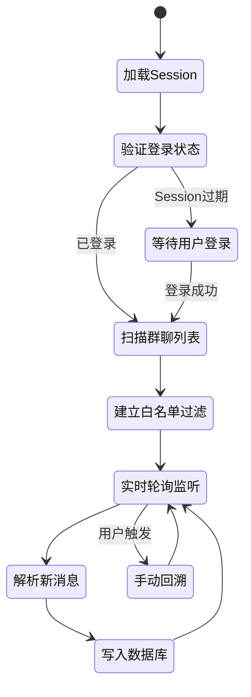

# Microsoft Teams 个人账号消息采集 — 需求分析与方案设计（定稿）

## 背景与目标

本方案旨在利用 Playwright 对 **Microsoft Teams 个人账号**（非企业 M365 账号）所在的群组 Chat 消息进行实时采集，将数据写入现有的 `database.sqlite`，并接入已有的智能分析与钉钉推送体系。

---

## 需求决策一览

| 决策项 | 结论 |
| :--- | :--- |
| 监控范围 | **仅群聊（Group Chat，3人以上）** |
| 历史消息回溯 | **默认不自动回溯**，但在 UI 上提供手动触发入口（与 TG 方案对齐） |
| 多账号支持 | **支持多账号并行运行** |
| 区域映射 | **需要配置大区映射**，接入区域分组日报 |
| 媒体文件 | **不下载媒体文件**，仅写入占位描述（如：`[图片]`、`[文件: xxx.pdf]`） |
| 安全优先级 | **安全性第一**，采集行为需伪装成自然用户，防控风险 |

---

## ⚠️ 关键前提评估

> [!IMPORTANT]
> **官方 Graph API 对个人账号不可用。**
> Teams 个人账号不具备 Microsoft Graph API 的 Teams 模块访问权限，这是 Microsoft 的架构设计限制。
> **Playwright DOM 自动化是唯一可行的采集路径。**

---

## 一、安全策略设计（最高优先级）

这是多账号 Teams 采集的核心难题，Microsoft 使用了企业级的多层防检测机制：

### 1.1 进程隔离 — 账号间完全独立

每个 Teams 账号运行在**独立的 Playwright BrowserContext + userDataDir** 中，账号间的 Cookie、本地存储、指纹信息完全隔离，互不干扰，和现有 WA 的 `whatsapp-session-{name}` 目录隔离策略完全一致。

```
teams-profile-{accountName}/
  ├── userDataDir/         ← Chromium 持久化 Profile（含 Cookie + LocalStorage）
  └── auth.json            ← Playwright storageState 备份
```

### 1.2 浏览器指纹伪装

使用 `playwright-extra` + `puppeteer-extra-plugin-stealth` 的 Playwright 适配版，在 JS 层面实施以下隐藏措施：

| 检测项 | 伪装手段 |
| :--- | :--- |
| `navigator.webdriver` | 设置为 `undefined` |
| 插件列表 | 注入假的插件信息 |
| Canvas/WebGL 指纹 | 添加微量随机扰动 |
| 语言/时区 | 与账号所在地区保持一致 |
| 屏幕分辨率 | 使用常见桌面分辨率（非整数倍） |

### 1.3 行为仿人化（关键）

这是最有效的防检测手段：

```
采集行为设计原则：

  ✅ 不连续快速切换 Chat —— 两个 Chat 之间随机等待 8-20 秒
  ✅ 滚动消息时模拟人类节奏 —— 每次滚动间隔 1-3 秒
  ✅ 轮询新消息频率 —— 每 30-60 秒检查一次（非实时长连接）
  ✅ 工作时间感知 —— 凌晨 01:00-06:00 降低到每 5 分钟一次
  ✅ 随机心跳模拟 —— 偶尔随机移动鼠标、切换到非采集 Tab
```

### 1.4 Session 保活策略

Microsoft 的 Token 有效期约 **90 天**，到期前系统会自动告警（复用现有钉钉告警机制）：

```
每次启动 → 加载 storageState → 打开 Teams
    ↓
检测是否弹出登录页？
    ├─ 否 → 正常进入采集流程
    └─ 是 → 将账号状态改为 'qr'（类比 WA 的二维码状态）
             → 钉钉推送告警：「[Teams] 账号 xxx Session 已过期，请重新登录」
             → 等待用户在 UI 上触发「重新登录」，弹出有界面的浏览器
```

---

## 二、采集架构设计

### 文件结构（拟新增）

```
workers/
  worker-teams.js            ← 主采集进程（类比 worker-wa.js）
lib/
  teams-session-store.js     ← Session 读写（复用 tg-session-store.js 模式）
  teams-page-parser.js       ← DOM 解析逻辑（选择器集中维护，便于更新）
  teams-backfill-queue.js    ← 手动回溯队列（类比 tg-backfill-queue.js）
teams-profile-{name}/        ← 每个账号独立的浏览器 Profile
  userDataDir/               ← 持久化 Profile（Cookie/LocalStorage）
  auth.json                  ← storageState 备份文件
```

### 主进程状态机



---

## 三、DOM 选择器策略

所有选择器集中在 `teams-page-parser.js`，按稳定性三级降级：

**优先级 1 — ARIA 角色（最稳定）**
```js
page.getByRole('list', { name: 'Chat list' })
page.getByRole('article') // 每条消息体
```

**优先级 2 — `data-tid` 内部属性**
```js
page.locator('[data-tid="chat-pane-item"]')    // 左侧 Chat 列表
page.locator('[data-tid="message-body-text"]') // 消息正文
page.locator('[data-tid="author"]')            // 发送人
```

**媒体消息处理（不下载）**
```js
// 检测到附件/图片，写入占位文本
if (await el.locator('[data-tid="attachment"]').count() > 0) {
  content = '[附件/文件]';
}
if (await el.locator('img[data-tid="messageImage"]').count() > 0) {
  content = '[图片]';
}
```

---

## 四、与现有系统的集成接口

### 数据库写入（直接复用）
```js
saveMessage({
  platform: 'teams',
  receiver_account: `teams-${accountName}`,
  message_id: msgId,
  group_id: chatId,
  group_name: chatName,
  sender_id: senderId,
  sender_name: senderName,
  content: content, // 纯文字 or '[图片]' 等占位
  has_media: 0,     // Teams 不存媒体，始终为 0
  timestamp: ts
});
```

### 区域映射（复用 `account-regions.json`）
```json
{
  "account": "teams-xxx",
  "region": "欧美区",
  "platform": "teams"
}
```

### Server.js 新增 API
- `POST /api/accounts/create-teams` — 创建 Teams 采集账号，启动登录流程
- `POST /api/teams/backfill/:name/start` — 手动触发指定账号的历史回溯
- `POST /api/teams/backfill/:name/pause` — 暂停回溯
- `GET  /api/teams/chats/:name` — 获取当前账号的群聊列表（供白名单选择）
- `POST /api/teams/whitelist/:name` — 设置群聊白名单

### UI 端扩展
- **添加账号** — 新增 `Teams` 平台选项，完成登录后显示群聊白名单选择（Step 4，与 TG 对齐）
- **账号管理** — 支持「重新登录」操作，弹出有界面的浏览器引导用户更新 Session
- **手动回溯** — 在账号详情页新增「触发历史回溯」按钮（与 TG 的回溯入口对齐）

---

## 五、账号状态告警统一架构（横跨三个平台）

> [!IMPORTANT]
> **这是一个独立的基础设施改造项**，适用于现有的 WA、TG 以及未来的 Teams。
> 三个平台当前都有「账号掉线/Session 过期」的告警需求，但各自直接调用 `sendAlert()` 推送到**业务群**，导致运维告警和业务告警混在一起，难以管理。

### 5.1 问题现状

```
当前现象：
  WA 掉线 → sendAlert() → 💬 欧美区业务群（混入运维信息）
  TG 崩溃 → sendAlert() → 💬 某业务群（混入运维信息）  
  Teams 过期（计划中）→ sendAlert() → 💬 某业务群

运维人员无法快速感知「哪些账号出了问题」，信息淹没在业务告警中。
```

### 5.2 解决方案：独立「系统运维」告警通道

**第一步：新增专属 Webhook 配置项**

在 `config/webhooks.json` 中新增一个独立的系统运维 Webhook，指向一个专门的运维通知群（有别于各区域业务群）：

```json
{
  "SYSTEM_OPS": {
    "url": "https://oapi.dingtalk.com/robot/send?access_token=xxx",
    "secret": "SECxxx"
  }
}
```

**第二步：在 `lib/dingtalk.js` 新增 `sendAccountAlert()` 函数**

专门用于账号状态类运维告警，固定推送到 `SYSTEM_OPS` 通道，不混入业务区域告警：

```js
// lib/dingtalk.js 新增
async function sendAccountAlert({ platform, accountId, region, status, detail }) {
  const statusIcon = {
    'disconnected': '🔴',
    'session_expired': '🟠',
    'reconnected': '🟢',
    'crashed': '💥'
  }[status] || '⚠️';

  const title = `${statusIcon} [账号状态] ${platform.toUpperCase()} | ${accountId}`;
  const content = [
    `### ${statusIcon} 采集账号状态变更`,
    `**平台：** ${platform}`,
    `**账号：** ${accountId}`,
    `**区域：** ${region || '未配置'}`,
    `**状态：** ${detail}`,
    `**时间：** ${new Date().toLocaleString('zh-CN', { timeZone: 'Asia/Shanghai' })}`,
  ].join('\n');

  // 固定推送到 SYSTEM_OPS 通道，与业务告警隔离
  return _sendToChannel('SYSTEM_OPS', { title, content });
}
```

**第三步：Webhook 配置 UI 改为「二级目录」结构**

> [!IMPORTANT]
> **这里包含一个独立的 UI 改造项**：现有 Webhook 配置页面展示的是所有配置项的平铺列表，随着平台（WA/TG/Teams）和告警类型（P0/P1/P2）增加，将变得极难维护。
> 需要改为二级展开的分组目录结构。

全局 Webhook 首层分组设计：

```
Webhook 配置（二级目录）
└── 🚨 业务告警                     ← 一级目录
    └── P0 严重业务中断         ← 二级配置项
        └── [WA] 欧美区 | 南亚区 | ...
    └── P1 业务异常
        └── [WA] 欧美区 | 南亚区 | ...
    └── P2 无响应告警
        └── [WA] 欧美区 | 南亚区 | ...
    └── SID 变更告警
        └── [WA] 欧美区 | 南亚区 | ...
└── 📋 日报                          ← 一级目录
    └── [WA] 欧美区 | 南亚区 | 亚太区 | ...
    └── [TG] 欧美区 | ...
    └── [Teams] 欧美区 | ...
└── 📊 周报                          ← 一级目录
    └── 全平台 全区域
└── 🔧 系统运维（账号健康）          ← 一级目录（新增）
    └── SYSTEM_OPS                ← 不分区域，全平台统一通道
```

每个二级目录展开后，对应的 Webhook 配置行包含：
- URL 输入框
- Secret 输入框
- 「测试推送」按鈕

**对应的 webhooks.json key 化标准：**

```
告警类型    平台    区域      →  key 命名
───────────────────────────────────────────────
ALERT_P0    wa      欧美区   →  ALERT_P0_wa_欧美区
ALERT_P1    wa      欧美区   →  ALERT_P1_wa_欧美区
ALERT_P2    wa      欧美区   →  ALERT_P2_wa_欧美区
ALERT_SID   wa      欧美区   →  ALERT_SID_wa_欧美区
DIGEST      wa      欧美区   →  DIGEST_wa_欧美区   ← 已有
系统运维    -       -          →  SYSTEM_OPS           ← 新增
```

> [!NOTE]
> **崩平迁移诞略**：现有代码中的 P0/P1/SID 告警均使用无分级的 `ALERT_wa_xxx` key。
> 新二级结构将在 `lib/dingtalk.js` 的 `resolveConfig()` 中增加优先级回退逻辑：
> `ALERT_P0_wa_欧美区` → 未配置时回退 `ALERT_wa_欧美区` → 再回退 `ALERT_wa` → 再回退全局 key
> 这样可以实现**逐步迁移，已配置的 Webhook 不受影响**。


### 5.3 改造范围

| 改造项 | 说明 |
| :--- | :--- |
| `lib/dingtalk.js` | 新增 `sendAccountAlert()` 函数 |
| `workers/worker-wa.js` | 将掉线告警改为调用 `sendAccountAlert()` |
| `workers/worker-tg-user.js` | 将崩溃告警改为调用 `sendAccountAlert()` |
| `workers/worker-teams.js` | 新建时直接使用 `sendAccountAlert()` |
| `config/webhooks.json` | 新增 `SYSTEM_OPS` 配置项 |
| `public/index.html` | 新增「系统运维告警 Webhook」配置行 |

> [!TIP]
> 这个改造**工作量极小（约 0.5 天）**，但收益显著：
> 运维人员可以有一个专属群，只看「账号健康」，不被业务消息干扰；业务同学也不会被运维噪音打扰。

---

## 六、开发工作量估算

| 模块 | 工作量 |
| :--- | :--- |
| `worker-teams.js`（主进程 + 安全策略） | 3 天 |
| `teams-page-parser.js`（DOM 探索 + 解析） | 2 天（DOM 调试成本高）|
| `teams-session-store.js` + `teams-backfill-queue.js` | 1 天（复用现有模式）|
| `server.js` API 扩展（5个接口） | 1 天 |
| `index.html` UI 扩展 | 1 天 |
| **统一运维告警架构改造**（WA+TG+Teams） | 0.5 天 |
| 集成测试 + 安全压测 | 1 天 |
| **合计** | **约 9.5 个工作日** |
